# Trail construction

```{julia}
#| echo: false
#| output: false
using PolygonOps
using Roots
using Plots
nothing
```

## Sustainable trails

Since 2007 the South Mountain Conservancy, primarily through the work of its Trail Work Crew, has incorporated several new miles of trails within the 50+ miles of trails. These new trails have been built with sustainability in mind. What makes sustainability an issue is *water erosion*. A failure to account for water flow can quickly turn a trail in good shape into a disaster.

In the following, we mention a few terms related to trails:

* hill slope -- the slope of the "fall line" at a given point on the hill
* trail grade -- the slope of the trail in the direction of the trail
* outslope -- slope of the trail in the direction *perpendicular* to the trail

Water, when unconstrained, should flow in a sheet manner down a hill following the hill slope. When this water hits the trail, it may run along the trail, not down the hill. This can cause erosion of the trail. Accounting for the various slopes is an important part of trail layout.


::: {.callout-note}
### Water is the enemy of a trail system

Water is the primary enemy of a trail system. Even in its most benign presence, when a trail is muddy, hikers tend to avoid the mud and widen the trail in the process. Even more damaging is when water is concentrated enough and flowing fast enough to cause erosion.

Water can carry sediment. Faster water can carry more sediment. During heavy rain, much of the trail surface can be picked up and moved by fast-flowing water. When water slows, it can not carry the same amount of sediment, and deposition occurs. A single storm can erode a trail section and also quickly fill in areas.

Doing everything possible to ensure flowing water does not run down the length of the trail is the key to having sustainable trails.


:::


The five essential elements of *sustainable* trails^[*Trail Solutions* IMBA's Guide to Building Sweet Singletrack]:

### 1. The half rule

The half rule says the trail grade should not exceed half the hill slope.

For an example, a fall line trail would have slope equal to the hill slope and would exceed the half rule. A contour trail would have zero slope and would satisfy the half rule. Of course, trails must gain and lose elevation, this rule limits how much elevation can be changed given the hill side.

The guidelines note that this is *still* important when the slopes are gentle.

For very steep hill sides, the slope should still not exceed more than 10-12 degrees, though there are instances where for very short lengths this rule may be ignored.


A simple rule of thumb is if it takes $x$ steps to walk directly up a hill, and it takes $2x$ steps to walk on a zig zag, the angle of the zig-zag route is less than half that of the direct one. This figure illustrates a possible switch back design with twice the length to walk and an angle less than half the original:

```{julia}
#| echo: false
raw"""
Why half?
Let ``\sin(\theta)=1/x``, ``\sin(\gamma) =1/(2x)`` then
``\sin(2\gamma) = 2\sin(\gamma)*\cos(\gamma) = 2/(2x) * \cos(\gamma) = \sin(\theta)*\cos(\gamma)``
So ``\sin(2\gamma) < \sin(\theta)``; as ``\sin(x)`` is increasing over ``(0, \pi/2)`` we have ``2\gamma < \theta`` or ``\gamma < \theta/2``.
"""
θ = pi/6
y = 1
x = 1/sin(θ)

plot(Shape([0,x,0,0],[0,0,y,0]);
     legend=false, aspect_ratio=:equal,
     axis=([], false),
     fill=(:gray, 0.05))

S1 = Plots.scale(Shape([0,x/3, x/3, 2x/3, x/3, x/2, 0, 0],
                       [0,  0,-1/6,-1/6,  1/4, 1/2, 1, 0]), 2, 1)
S2 = Shape(S1.x[2:3], S1.y[[2,5]])
S3 = Shape([S1.x[6], S1.x[6]], [S1.y[6], 1/16])
plot!(Plots.translate(S1, 3x/2, 0),
      fill=(:gray, 0.05)
      )
plot!(Plots.translate(S2, 3x/2, 0))
plot!(Plots.translate(S3, 3x/2, 0))
```


### 2. The ten percent average guideline

The half rule applies for a small section of trail; the ten percent average says the end to end grade should be no more than 10 percent. (1000 feet over 2 miles is an example.)

We have generally been conservative here.


### 3. Maximum sustainable grade

The maximum grade is the maximum slope of a section of a length more than 10 feet. It is said 15-20 degrees is the maximum. For hiking trails, we've aimed for 10 degrees. Factors which can change the maximum slope are: soil type, rock, rainfall, grade reversals, number of users (more users, less slope)


### 4. Grade reversals

A grade reversal means varying the slope of the tread from downhill to uphill. Any water flowing along the trail will fall to the changeover where it can be removed off the trail with a knick (semi-circular shaved down section of trail). Grade reversals are laid out when the new trail is built.


The US Forest Service^[ See [https://www.fs.usda.gov/t-d/pubs/htmlpubs/htm07232806/page06.htm](https://www.fs.usda.gov/t-d/pubs/htmlpubs/htm07232806/page06.htm)] describes a knick by

> The knick is an effective outsloped drain. Knicks are constructed into existing trails (figure 13). For a knick to be effective, the trail tread must have lower ground next to it so the water has a place to drain. A knick is a shaved down semicircle about 3 meters (10 feet) long that is outsloped about 15 percent in the center (figure 14). Knicks are smooth and subtle and should be unnoticeable to users.

::: {#fig-US-Forest-knick}

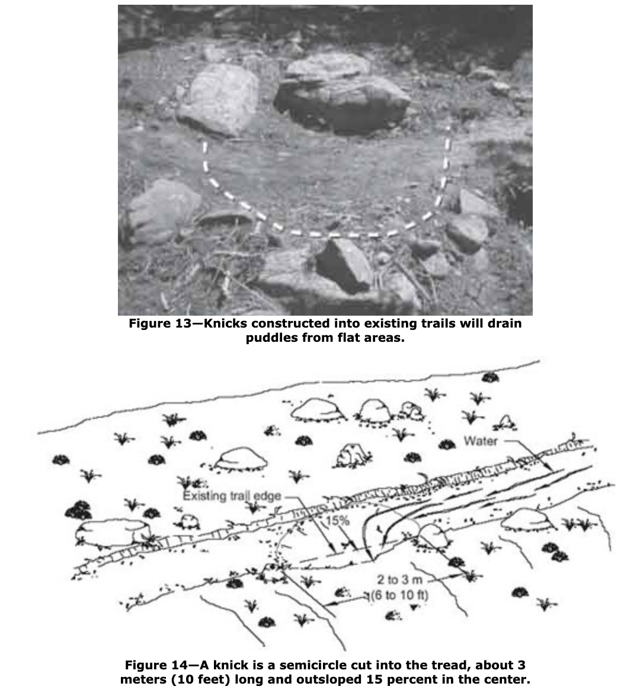{{#fig-US-Forest-knick}

: A knick is a trail improvement to shed water without creating an obstacle like a waterbar.
:::

### 5. Outslope

Outslope is recommended to be 5 percent. This encourages water to flow off the trail.

Of course, one can't outslope the trail tread $5$ percent if the hill slope is less than $5$ percent. It isn't advised to put trails on flat ground, as it is difficult to manage water flow.

Road construction offers an analogy: a road is crowned online its middle and slopes outward to both edges. This encourages water flow to the edges. At the edges curbing (often Belgian block) is used to constrain the water flow parallel to the road way. If this is not present, erosion at the road edge is common.

The outslope is similar to the crown. Also important is the **avoidance** of mounds on the trail edge that act like curbing. Unlike a road, water flow should flow off the trail and *not* parallel to the trail. Berms naturally build and may be knocked down by foot.

```{julia}
#| echo: false
#| fig-caption: Cross section showing outslope of 5 degrees, benchcut of 45 degrees, dirt to be removed and cast aside during construction.
hill_slope = 30*pi/180
outslope = 5 * pi/180
width = 24
x = -width * cos(outslope)
y =  width * sin(outslope)
p = (x=x,y=y)
q = (x=0,y=0)
# solve((x - sqrt(2)/2 * t ~ -sqrt(3)/2*s, y + sqrt(2)/2 * t ~ 1/2*s), (t,s))
r = (x=-51.62, y=29.8)

plot(Plots.Shape([r.x, r.x, q.x], [r.y, q.y, q.y]);
     legend=false, aspect_ratio=:equal,
     axis=([], false),
     fill=(:gray, 0.1), line=(2,))
plot!(Plots.Shape([r.x,p.x, q.x, r.x], [r.y, p.y, q.y, r.y]);
      fill = (:gray, 0.3))
plot!([p.x,q.x],[p.y,q.y], line=(5,), color=:red)
plot!([p.x, p.x, q.x], [r.y, p.y, p.y], line=(1, :gray, :dash))
annotate!([(-15, 1.5*sin(outslope), "5⁰"),
           (-5, 2*5*sin(outslope), "30⁰"),
           (-30, 15, "Benchcut")])
```

The figure shows a cross section of the trail. The tread is in red. The 5 degree outslope is about 5 inches over 5 feet, which coincides with the width of the head of the [McLeod](https://en.wikipedia.org/wiki/McLeod_(tool)) and its handle length. This allows eyeballing the correct slope by placing the head on the tread and ensuring the end of the handle is just about over the edge of the head. Even more informally, 5 degrees is just about the angle where one feels pressure on the downhill side of ones shoe when pointing in the direction of the trail.


#### Benchcut

The figure shows the benchcut needed to make an outslope of 5 degrees when the hill slope exceeds 5 degrees. The dirt should be removed and broadcast widely to hide the activity.

Benchcuts should not be to steep (the one in the figure is 45 degrees).

The interface between the benchcut and the tread should not encourage water flow down the trail -- it should be smooth

Take care when roughing out the trail so that the top edge of the benchcut is a smooth line in the direction of the tread. The benchcut will guide walkers to stay on the trail tread during the months when leaves have fallen on the trails.

----

### Trail layout

A new trail is first sited roughly using ribbon to mark out the passage. New trails should consider not just water flow, but also purpose. The trail systems is quite mature and new trails are likely not needed anymore. In the event a trail is to be designed, try to incorporate natural features (large rocks, streams, viewpoints, ...) in the design. New trails should avoid excessive growth, like grass or ferns which indicate an abundance of water.

When designing the trail path, think about reverse grades.

After roughing out the trail, a clinometer is brought in to assess the angles to ensure the trail does not exceed the slope requirements suggested.

A trail is then flagged with pin flags. We flag the *uphill* part of the trail, where a bench cut would be set. (The bench cut would connect the flags in a straight segments).

When there is a switch back, two pin flags are used to indicate a switch of uphill side.

The tread width is 18-24", about shoulder width or a bit wider for single track. Making the trail wider is counterproductive. We want footsteps to compact the trail inhibiting vegetation.

The creation of a trail tread involves several steps:

* move any leaves *uphill* of the intended trail. (These will be used at the end to cover off-trail dirt.)
* use an adze hoe or McCleod to make the bench cut
* remove the wedge of dirt needed. Dirt should be broadcast downhill; not lumped into an unnatural pile
* We aim to remove the *organic* dirt from the tread. Organic dirt holds moisture and leads to mud, not water flow.
* Some rocks may stay -- if large and anchored; others are dug out. It is not recommended to try and fill holes that are made -- it is better to leave large rocks, not large holes.
* Small roots should be cut; larger ones left. (Though roots which may encourage water flow along the trail should be removed.)
* Once roughed out, use the McCleod to smooth the trail in the direction of the tread.
* Ensure the trail has proper outslope and no berm on the downhill side. Do not put rocks or limbs on the downhill side (a path to Grandma's house), as this inhibits water flow off the trail.
* Use the head of the McCleod to tamp down the loose dirt
* Use the reserved leaves to cover up any dirt and form the downhill edge of the trail


::: {.callout-note}
#### Not what is in the IMBA guide

The IMBA guide suggests this order:

* dig the tread
* cut the backslope (bench cut)
* outslope the tread
* compact the tread.

The order above prioritizes the initial bench cut to give a cleaner edge to the finished trail.
:::


::: {.callout-note}
#### Trail building is slow

Trail building proceeds at a slow and steady pace. Trying to do too much results in poor, unsustainable trails.

:::

::: {.callout-note}
#### Organic soil removal

Trail building for the uninitiated might seem easy, just scrape the grass or leaves away and you have a new trail. However, it is much more involved. Beyond managing the layout and the slopes, another  key is the removal of the organic top level of soil. This layer is formed  by the decomposition of leaves and in general is a good thing, as vegetation is likely to grow faster and bigger in organic soil.

However for a trail, we want soil that does not retain water, rather sheds it. We want soil that can compact, and inhibit vegetation. The soil under the organic layer in the SMC is usually clay-ey and is desirable. Organic soil is darker and fecund looking; clay is less dark and compact. When removing the organic, we look for a color change. Depending on location, organic soil can be 1/2 inch to several inches deep.
:::

### Steps to manage steeper sections

The trail-work crew has utilized wooden steps over the years, for example at the Tulip Springs Parking Lot. These steps are in their second iteration, as the wood used can wear out over time or with heavy usage.

Since 2025, efforts to build stone steps have been undertaken. Success has come by utilizing very heavy rocks (~200 pounds). There is now a winch to move such rock monsters. The work is slow and one step might take 1-2 or more hours to install, but the expected longevity is much increased over wood.

Anchoring a single stone can be made easier by digging a conical shape in the dirt which allows sufficient points of contact and settling of the heavy stone without anchoring. Multiple steps are typically stacked so that the top stone is perched on a lower stone, the base stone being the largest and well anchored.

Examples are on the Beech Brook Cascade re-route.


## Existing trail

Water management for *existing* trails is different. In the South Mountain Reservation, much water flow is engineered by the use of swales and culverts to **not** flow as sheets along the surface. For such concentrated flows, simple trail design as above is not enough.

We mention here a few techniques to manage water flow once it has aggregated.

### Fords

Fords are designed to allow water to flow *across* the trail. This water is already channeled, as can happen through uphill engineering (drainage of culverts for example) or natural water flow.

The design for fords takes *two* basic shapes: a trench or a smoothed out crossing.

#### Trenches

Trenches are commonly reinforced on the edges with rocks, a common design on the trails dating to the CCC days. Most of these are *also* accompanied by uphill drainage collectors, often in the shape of a "Y" -- with two collecting arms and the bottom of the "Y" forming the ford. The collecting arms may also be called drainage swales.

The width of a trench has a few constraints:

* If a trench is too narrow, leaves will get caught on sides and block water flow
* The trench can't be wider than a single step across for a hiker. This means *maybe* 18" maximum.
* If they are wider than a bicycle wheel can comfortably cross, the bicylists will *often* put in a rock to cross the ford **thereby defeating the purpose** which is for water to flow through the ford.

The depth of the trench and the width determine the cross sectional area which must be large enough to accommodate peak water flow.

The following illustration shows how a wheel of a given radius flows over a ford. In this illustration the ford is kept fixed and the radius varies, unlike in real life where the radius of a wheel may be 29/2 inches.

```{julia}
#| echo: false
#| eval: false
function f(R=29/100)
    ts = range(-2, 2, 251)
    f(x) = 1 + sum(sinpi(k*x)/k for k in 1:2:17)
#    R = 29/100 # inches
    function wheel(c, x)
        θs = range(0, 2pi, 100)

        (x .+ R .* cos.(θs), c .+ R .*  sin.(θs))
    end


    y₀ = -2R
    xs = vcat(ts, reverse(ts), first(ts))
    ys = vcat(y₀ .+ zero.(ts), f.(reverse(ts)), y₀)
    poly = tuple.(xs, ys)


    ips(c,x) = sum(inpolygon(pt, poly) for pt in zip(wheel(c,x)...)) - 1/2
    g(x) =  find_zero(c -> ips(c,x), (0,2 +3R))


    as = range(-1.75, 1.25, 251)
    bs = f.(as)
    cs = g.(as)
    plot(as, bs, legend=false, aspect_ratio=:equal)
    for (i, (a,c)) in enumerate(zip(as, cs))
        iszero((i-1) % 3) || continue
        us, vs = wheel(c, a)
        plot!(Plots.Shape(us, vs), fillcolor=:gray, fillalpha=0.001, linewidth=0)
    end
    plot!(as, cs; linecolor=:red)
    current()
end

anim = @animate for r in 0.2:0.1:1.5
    f(r)
end

imgfile = "construction_graphics/trench_size.gif"
gif(anim, imgfile, fps = 5)
nothing
```

::: {.content-visible when-format="html"}

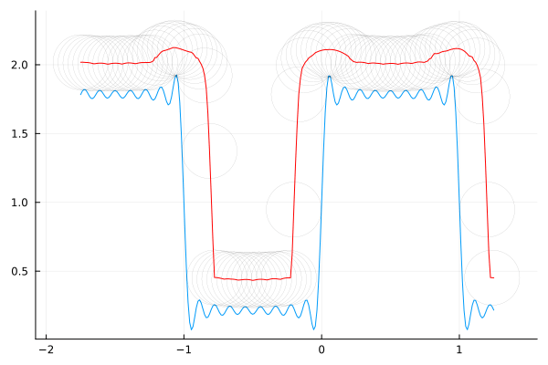

:::

::: {.content-visible unless-format="pdf"}


:::

The red line shows the axle of the wheel.

While not the strongest illustration, the point to take away is:

* the animation shows what would happen were the trench twice the width of the wheel (bumpy) to half the radius of the wheel (smooth).

* if the trench is too wide for wheel -- when the trench is wider in the animations -- the wheel will not roll smoothly (leading mountain bikers to act). The wheel is typically around 15 inches in radius, and anything bigger than 12" would be problematic.

Most of the current fords are much narrower, maybe 6-8 inches across. It is believed 8-12 inches is a better balance between allowing sufficient water flow while providing a good experience for both hiker and biker.

::: {#fig-CCC-fords layout-ncol=3}

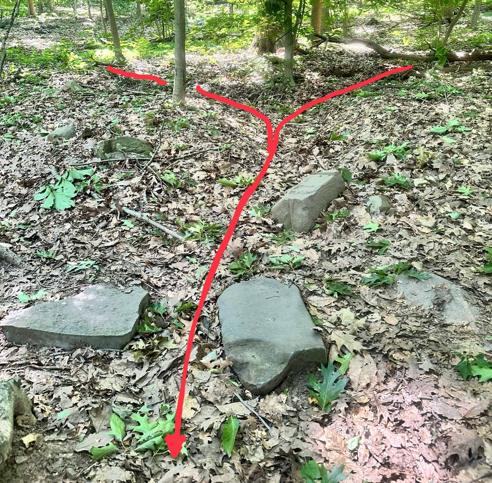

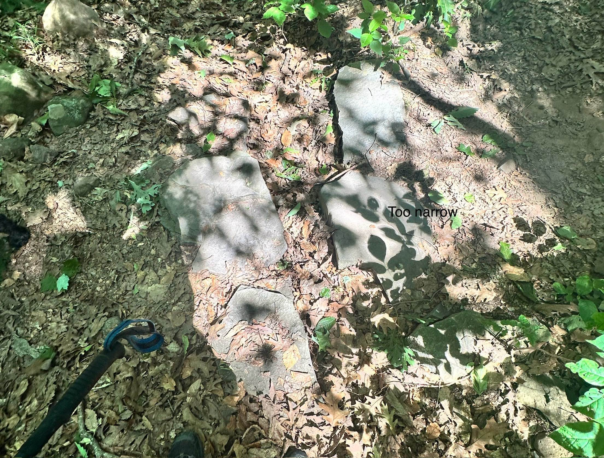

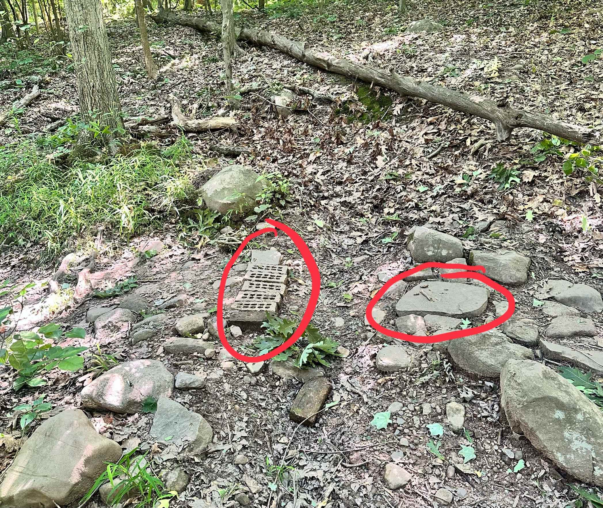

Two CCC fords and a new one in the style. On the left is hint of the "Y"-collector design. The stones for the ford could be re-positioned. The middle figure shows a too-narrow part. Though hard to see in the photo, there is much leaf accumulation in the narrow part which inhibits effectiveness of the ford. The right figure illustrates two issues: use of non-natural materials, insufficient size for stepping rock.
:::

#### Fords

A better design is to use a smooth entry and exit for the bicycle rider. The figure below illustrates three possible cross sections. This design allows the same *cross sectional area* as a trench (important so water can flow during peak times) by varying the width and depth, but is smoother for the user.

```{julia}
#| echo: false
f(x) = cospi(2x - 1)
g(x) = 1/2 + f(x/2)/2
x = [-1/2, -1/4, -1/4, 1/4, 1/4, 1/2]
y = [1, 1, -1, -1, 1, 1]
plot(f, -1/2, 1/2; legend=false,  axis=([], false))
plot!(x,y)
plot!(g, -1, 1)
```

The suggested design would be about 2 feet across and 4-5 inches deep.

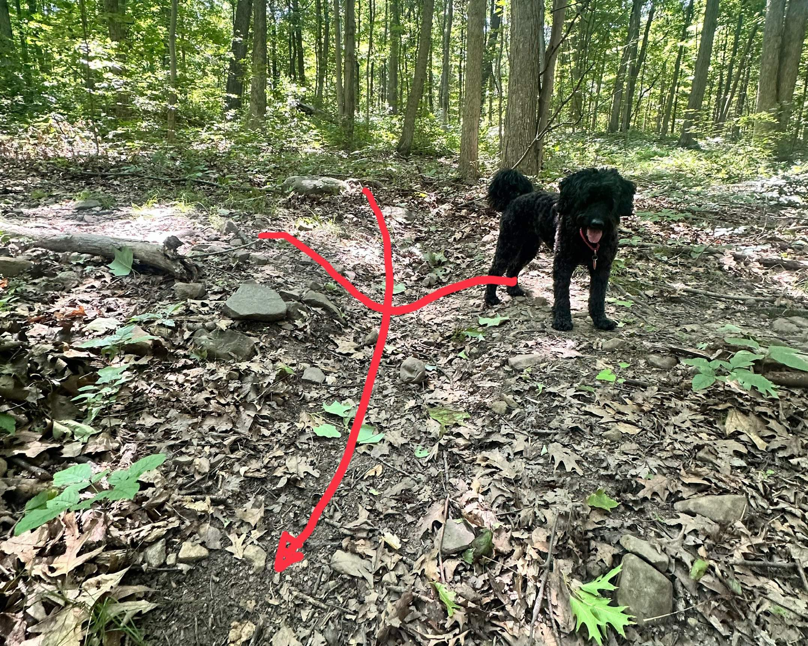

::: {.callout-note}
#### Takeaway

For existing trenches, make sure they are clear and sufficiently wide to not catch leaves.

For new fords, use a smoother design for better trail experience.

Do **not** design new fords so deep that you want to put a rock in the ford to facilitate the step over -- this defeats the purpose of the ford. Wider is better than deeper for the user.

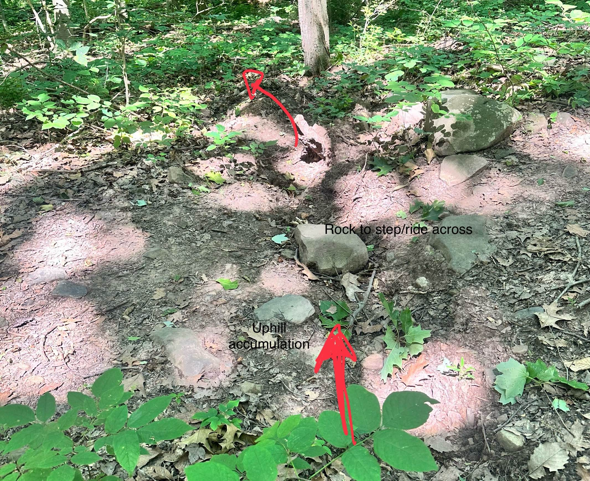

For heavily traversed areas, Belgian block reinforced fords have been used. This is an unnatural look, so should be avoided unless needed.

:::

In addition, fords may gather *sediment* over time, reducing the amount of water that can flow across in a given period of time. This is due to water slowing down at the ford. Slower water can carry less sediment, so when the flow slows, suspended sediment can be dropped.

Water slowing down can happen for several reasons:

* the downhill angle of the ford is less than the downhill angle of the uphill waterflow
* the width of the ford is narrower than the width of the water flowing into the ford.
* The ford narrows at a point
* the ford has a bend
* there is inadequate downhill drainage for the ford

All of these should be considered when creating a new ford and minimized as best as possible to reduce the need for future maintenance.


::: {.callout-note}
#### New ford construction

The suggested new ford construction then would be:

* Site fords where water is crossing or entering the trail. Often such water is channeled above the trail.
* Use "Y" collector design to capture as much surface flow as possible
* Ensure sufficient water run off so that water won't back up into ford or flow back onto trail downhill from the ford


"Y" collectors may do *two* things:

* collect water running along surface during heavy rains *and*
* capture groundwater as it moves downhill after a rain.

The former leads to a necessary design of a 4-6 inches of depth, more on steeper sections. The latter is different. Groundwater mostly runs between layers of soil: the organic and the more compacted inorganic. When there is groundwater seepage, The depth of the "Y" collector arms should be at least a few inches deeper than this soil boundary.

The arms of the "Y" collector (drainage swales) should be sufficiently off the trail to not be a tripping hazard for walkers. They should run downhill -- not on a contour. They should be a straight as possible. They will likely have vegetation over time or be filled with leaves. When constructing -- like all *off-trail* features -- they are ideally covered with leaves to mask their presence.

If building a ford with a rock crossover, like was done the by the CCC, remember a simple design goal:

> The CCC projects have lasted 100 years, yours should as well

This can be achieved by ensure the rocks utilized are

* large (80+ pounds);
* well anchored with several inches below the bottom of the ford;
* chosen to have a large platform for stepping onto

The best stones should be positioned in the center of the trail to encourage users to take them. For popular trails, the crossover should be wide enough so that two people can step over at the same time.
:::

::: {.callout-note}
#### Off the trail

To re-iterate---keep the swale off the trail.

There have been a few examples where this hasn't happened and perhaps for good reason, but it really is a poor design choice.
:::

### Water bars

Fords allow channeled water to cross over a trail in a perpendicular manner. A *water bar* is used to move water that is flowing *down* the trail off the trail.

Water bars may be constructed of rock or wood, but we use rock harvested on the site to create water bars. This ensures the longest lasting, most natural looking waterbar.

The placement of a waterbar considers:

* A waterbar should capture the waterflow as early as possible.
* If designed well, they should capture all the  water coming down the trail. They need not be spaced close together.


The design of a waterbar^[The *AMC'c Complete Guide to Trail Building and Maintenance* is consulted here. Waterbars are not favored in the IMBA book, as knicks and other on-trail drainage provides a better biker experience.]

* the should be at a 45-60 degree angle to the trail. As the water slows down on hitting a waterbar, there will be more sediment buildup were the water bar at less of an angle

```{julia}
#| echo: false
theta = 60
x=[0,1]
y = [sind(0), sind(60)]
plot(x, y; legend=false, aspect_ratio=:equal)
vline!([0,1], line=(:gray, 0.5))
annotate!([(.1,.05, "θ ~ 45-60 degree", :left)])
quiver!([0.5], [0.2], quiver=([0.0],[0.5]))
```

* the waterbar is a vertical feature, like the curbing on the road. It does not include a swale in front of it. Swales will only fill in with sediment over time. (This is not necessarily suggested by the AMC, but experience shows otherwise.)

* waterbars should encourage water to drain off the trail. Rather than a swale, the outslope of the tread should be used with a 5 degree outslope.

Waterbars are made of rocks.  Ideally rocks can be found to allow for shingling so water does not seep through the interface between two rocks. The AMC describes two styles: the *cake* style where large flat rocks abut each other giving a place to step on the top of the water bar and a flat face for the water to flow across; the *toast* style uses shingle like rocks (overlapped) and are generally narrower and not meant for stepping on.

The US Forest Service has some guidance on when waterbars are effective:

> On grades of less than 5 percent, waterbars are less susceptible to clogging unless they serve a long reach of tread or are constructed in extremely erodible tread material. On steeper grades (15 to 20 percent), waterbars are prone to clogging if they are at less than a 45-degree angle to the trail. Waterbars are mostly useless for grades steeper than 20 percent. At these grades a very fine line exists between clogging the drain and eroding it (and the waterbar) away.

And

> Are waterbars ever useful? Sure. Wood or rock waterbars are useful on foot and stock trails where a tripping hazard is acceptable, especially at grades less than 5 percent. Also consider reinforced or armored grade dips where you don't have much soil to work with and in areas that experience occasional torrential downpours.

::: {#fig-waterbars layout-nrow=2}
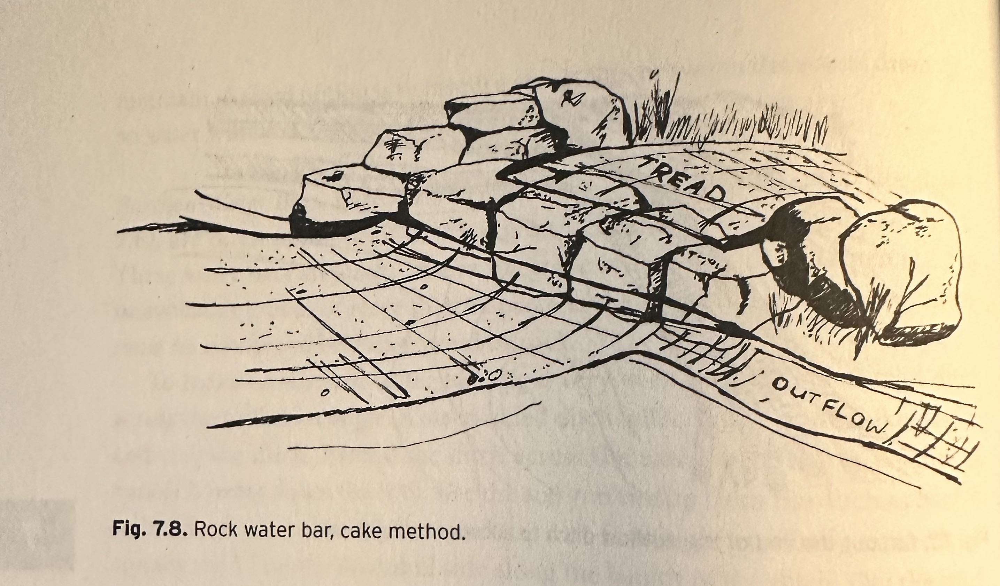{#fig-cake}

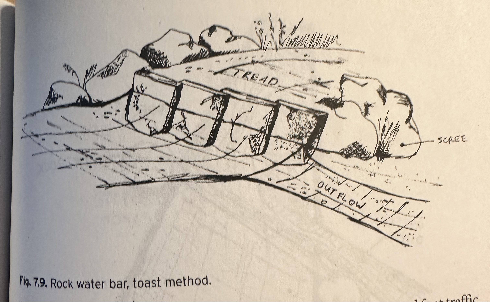{#fig-toast}

Two waterbar construction styles. (AMC)
:::

::: {#fig-waterbars-usda layout-nrow=2}
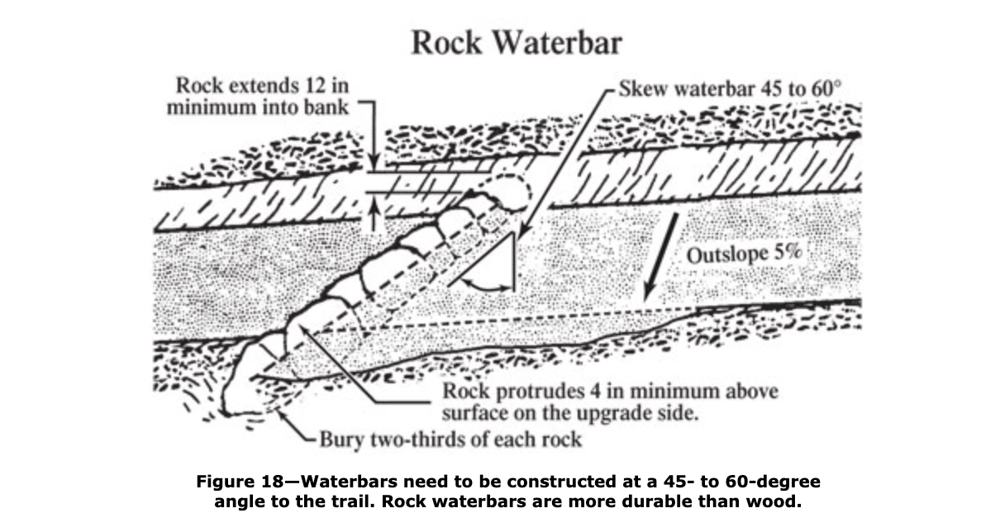{#fig-waterbar-usda}

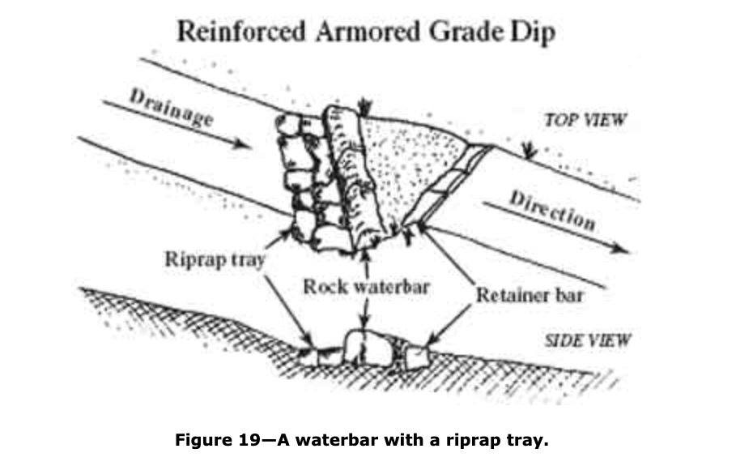

: Two waterbar designs from the [United States Forest Service](https://www.fs.usda.gov/t-d/pubs/htmlpubs/htm07232806/page06.htm)
:::

Some design guidance:

* Pick large enough rocks. Small rocks will not survive over the many years the waterbar is expected to last.
* The face of the waterbar should extend up 4 inches. (Like the curbing on a road.)
* The rocks should be well anchored, extending into the ground some 6-10 inches.
* the rocks should provide a platform for stepping across, as the design encourages walkers to do so. The anchoring should ensure that when a rock is stepped upon, there is no movement of the water bar.

Expanding on this, waterbars should have rocks *solidly* anchored in place. Anchoring a rock requires a few things: first the rock should be sufficiently large so 6-10 inches of rock can be buried below the surface. Next, dig a "grave" for the rock as tight as possible. Then hammer (with a pick or large rock) pointed rocks on the side of the rock to firm up the placement. Back fill with gravel or smaller rock, then use dirt to cover.

::: {.callout-note}
#### Anchored

Any rock on the trail should not rock when stepped on and should definitely not be loose. This requires the use of large rocks. Do not expect rocks to "settle." They should be solid when the waterbar is constructed.
:::

Rocks placed on the side of a water bar force the users to stay on the trail. If not anchored, these should be piled large enough to discourage being stepped on.

For hikers and bikers adding packed dirt to the height of the *downhill* portion of the waterbar allows both to smoothly move uphill. The height of the waterbar is not so high to make it difficult to cross going downhill (yet still tall enough to capture and divert strong waterflow).

In the middle of the trail, it is helpful to have a rock placed that has a top face encouraging stepping on. (The cake method has all it rocks so.)

#### Armored grade dip

The US Forest Service also has directions on armored grade dip (@fig-waterbars-usda) the design of which involves a water bar:

> A variation from the traditional waterbar is the waterbar with riprap tray. The riprap tray is built with rock placed in an excavated trench. The tops of the rocks are flush with the existing tread surface, so they're not an obstacle to traffic. Next, construct a rock waterbar. Use rectangular rocks, chunkers, butted together, not overlapped. Start with your heaviest rock at the downhill side—that's your keystone. Lay rocks in from there until you tie into the bank. Bury two-thirds of each rock at a 45- to 60-degree angle to the trail.

> Add a retainer bar of rock angled in the opposite direction from the waterbar. The downhill edge of the retainer bar is at an angle so it nearly touches the downhill edge of the waterbar (figure 19). Fill the space between the waterbar and retainer with compacted tread material.


### Swales

The engineered design of the woods roads was done by the CCC and involves swales and culverts. In addition, on the trails the CCC used drainage swales as part of the "Y" drainage features. The design of these drainage swales is less critical. We discuss the design and maintenance of the carriage road swales here.

The basic design employed by the CCC when putting in a carriage road had downhill waterflow channeled into an uphill swale running parallel to the road. Periodically the water is routed under the road using a culvert. After nearly 100 years, this design has mostly held up, but there are areas where maintenance is needed.


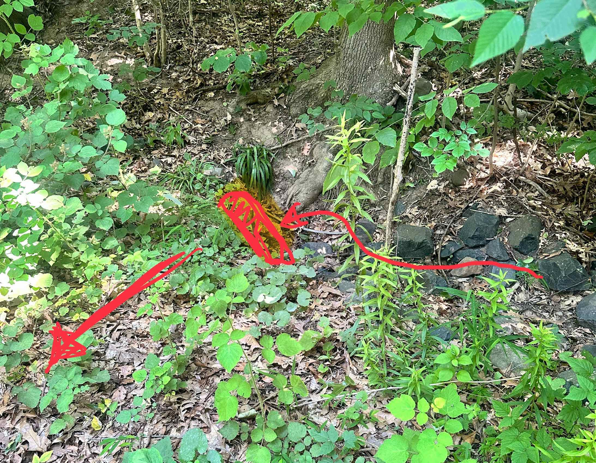

The peak amount of water a swale sees is related to the surface area of the region draining into the swale and the amount of rain falling. The swale must be large enough in cross-sectional area to accommodate peak water flow, otherwise it will be breached.

::: {#fig-breached layout-nrow=2}

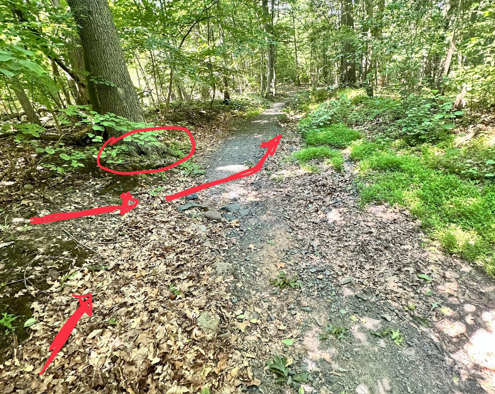

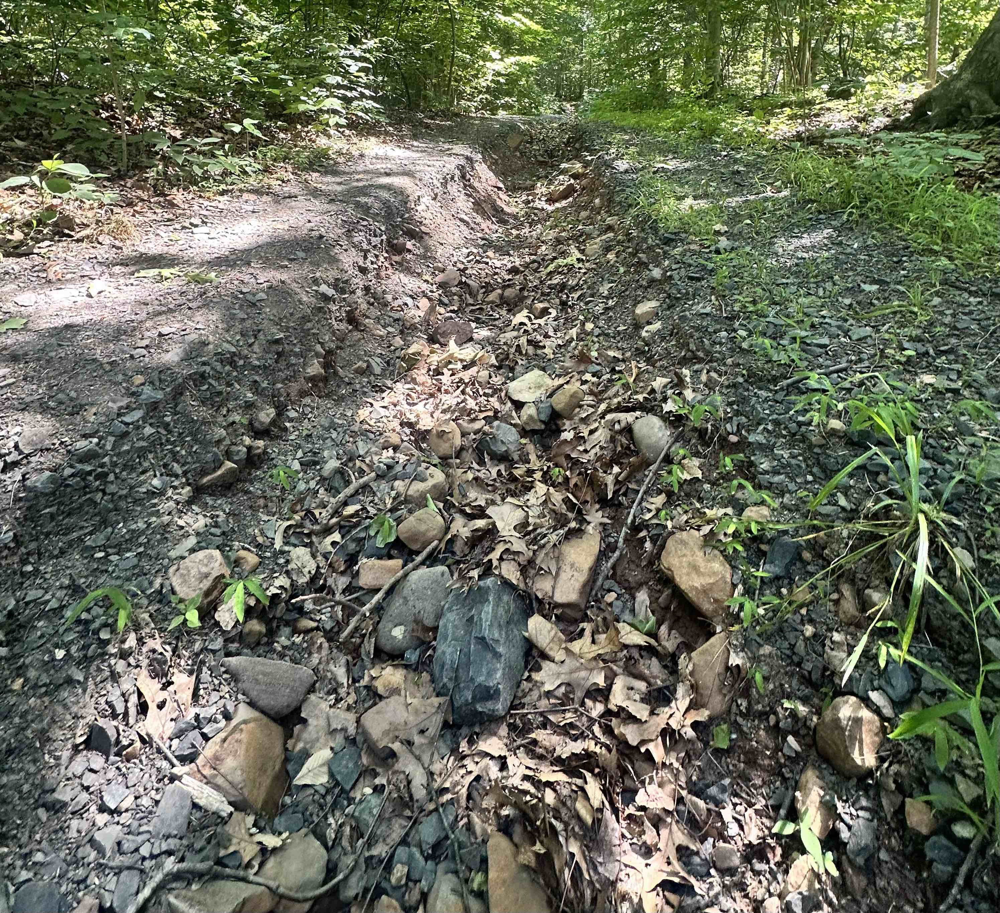


Breach on Hillspur trail leading towards massive downhill erosion. The breach is due to: side flow entering trail; a tree that has grown to block swale flow since the 1930s; deposition of leaves due to water slowing
:::


The swales are often filled with rock called riprap.

#### Technical design of swales

The following primarily comes from consulting a [State of Mississippi](https://opcgis.deq.state.ms.us/Erosion_Stormwater_Manual_2ndEd/Volume1/Chap_4_Sections/4_4/V1_Chap4_4_Runoff_Conveyance_RS.pdf) document.

Swales are broad shallow ditches used to capture rainwater.

Swales may be filled with grass or riprap, erosion resistant rock used to slow water flow and inhibit soil erosion.

Drainage swales, as described, are used to divert stormwater into designated fords.

The swales along the historic carriage roads are used to manage larger volumes of stormwater  uphill of the road until a culvert is used to discharge the water, crossing under the road to the downhill side.

The design of a swale cross section and lining is based primarily upon the volume and velocity of flow expected in the swale. Riprap-lined swales should be used where velocities are in the range of 5 to 10 ft/sec.

In road construction, Riprap-lined swales are trapezoidal in shape. (The steepest permissible side slope of the swale should be 2:1; Horizontal: Vertical.) In South Mountain Reservation, the swales ore "U"-shaped.

We read "outlet conditions for all swales should be considered. This is particularly important for the transition from the riprap lining to a vegetative lining. Appropriate measures must be taken to dissipate the energy of the flow to prevent scour of the receiving swale." This may not be applicable in the SMR, though there is engineering in the swale as they approach a culvert.

"Lined swales shall be designed to convey the peak rate of runoff from a 10-year
24-hour rainfall event." We can only assume this calculation was done correctly in the 1930s during the construction.


Design flow depth should accommodate peak water velocity which by the  [Manning formula](https://en.wikipedia.org/wiki/Manning_formula) is

$$
V = \frac{k}{n}R_h^{2/3}S^{1/2}
$$

where:

* $S$ is the bed slope in (feet/feet). Steeper slopes lead to increased velocities in a square root manner
* $R_h$ is the hydraulic radius of the swale. It is basically the cross-sectional area divided by the perimeter. (Water flows slower along the boundary, so perimiter length inhibits velocity.)
* $n$ is Manning's coefficient of roughness (which is modified by the rip-rap; bigger $n$ means slower velocities.)
* $k$ a conversion factor.

The parameters that can be engineered are $n$ (by adding riprap) and $R_h$.

The latter is manageable. The cross sectional areas of the swale can be impacted by several manageable things:

* often cut logs are placed in swales
* since the 1930s trees may have grown on the edge of swale
* pinch points where leaves collect can cause a reduction in cross-sectional area
* some rip-rap is too large for the use and reduces the area

For the latter, Mississippi gives guidance from the *Design of Roch Chutes* by Robinson, Rice, and Kadavy:

For slopes between 2 and 10 percent the median diameter is given by $(q\cdot \sqrt{S}/4.75 \cdot 10^{-3})^{1.89}$. In short:


* Bigger swales have bigger $q$s, so bigger rocks are permissible.
* Bigger slopes allow bigger rocks.

Empirically, softball sized stones seem to be appropriate for larger stones

Mississippi says:

* The layering should be a dense, uniform, and wellgraded mass with few voids. Riprap should consist of a well-graded mixture of stone (size and gradation as shown in design specifications) that is hard, angular, and highly chemical, and weather resistant.
* Larger stone should predominate, with sufficient smaller
sizes to fill the voids between the stones.
* The diameter of the largest stone size should be not greater than 1.5 times the d50 size.
* Minimum thickness of riprap liner should be 1.5 times the maximum stone diameter.

Mississippi says for maintenance:

* Inspect channels at regular intervals and after storm events. Check for rock stability, sediment accumulation, piping, and scour holes throughout the length of the channel.

* When stones have been displaced, remove any debris and replace the stones in such a way as to not restrict the flow of water.


* Look for erosion at inlets and outlets.

* Give special attention to outlets and points where concentrated flow enters the channel and repair eroded areas promptly by extending the riprap as needed.


The design of swales in the SMR, and elsewhere, at an outlet (a culvert) is to give a slight uphill wiggle in the otherwise parallel-to-the-road route. This encourages water flow into the culvert by bouncing it on the opposite wall or inducing an eddy.

However, this design also slows water, which causes sediment -- and  noticeably leaves -- to accumulate some 5-10' uphill of the culvert. Clearing this should also be added to maintenance.

### Reroute?

The US Forest Service offers this guidance on rerouting a trail:


> If you've tried various drainage methods and water is still tearing up your trail, it's time to think seriously about rerouting the problem sections. Reroutes are short sections of newly constructed trail. This is your chance to incorporate all the good design features of a rolling contour trail that encourages water to sheet across the trail. Remember the good stuff:

> * Locating the new section of trail on a sideslope
> * Keeping the trail grade less than half of the grade of the hillside
> * Building with a full bench cut to create a solid, durable tread
> * Constructing plenty of grade reversals
> * Outsloping the tread
> * Compacting the entire trail tread
> * Make sure the new section that connects to the old trail has nice smooth transitions—no abrupt turns.

> * Some short sections of eroded trails may not be major problems. If the trail surface is rocky—and water, use, and slopes are moderate—this section could eventually stabilize itself. A short section of eroded trail may cause less environmental damage than construction of a longer rerouted section. Weigh your options wisely.
